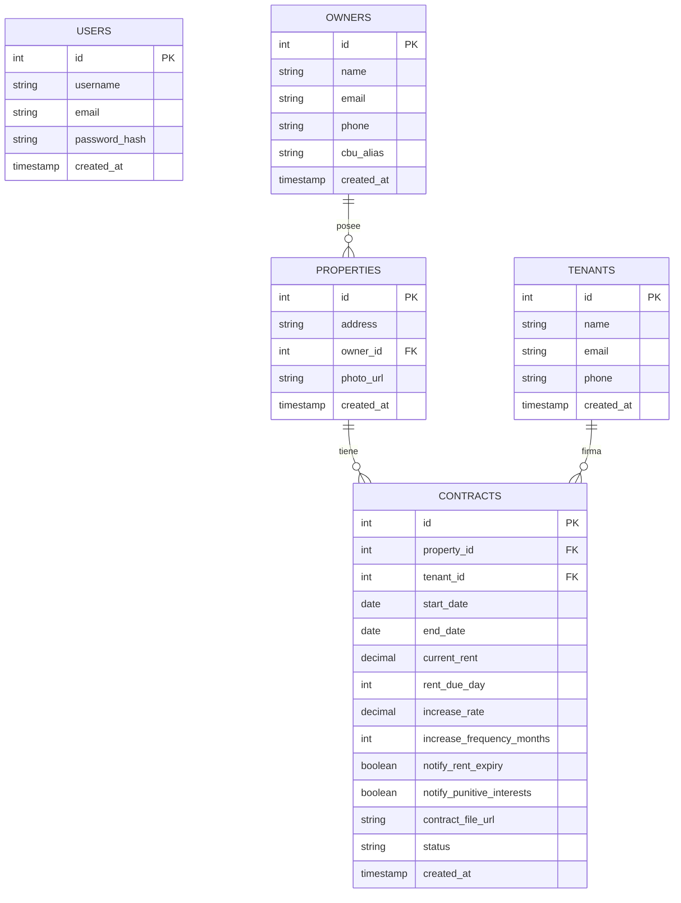

# Esquema de Base de Datos (EER Diagram)

Aquí tienes una representación visual de las relaciones entre tus tablas. Puedes previsualizar este archivo en VS Code (Ctrl+Shift+V) para ver el gráfico.

### Descripción de Relaciones
1.  **Owners -> Properties**: Un propietario puede tener muchas propiedades (1 a N).
2.  **Properties -> Contracts**: Una propiedad puede tener contratos asociados (historial).
3.  **Tenants -> Contracts**: Un inquilino está asociado a contratos.
